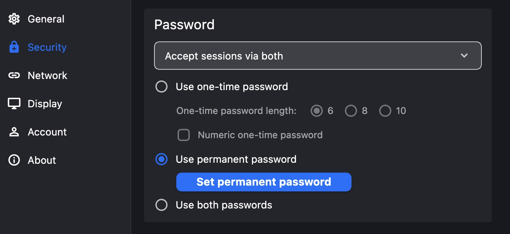
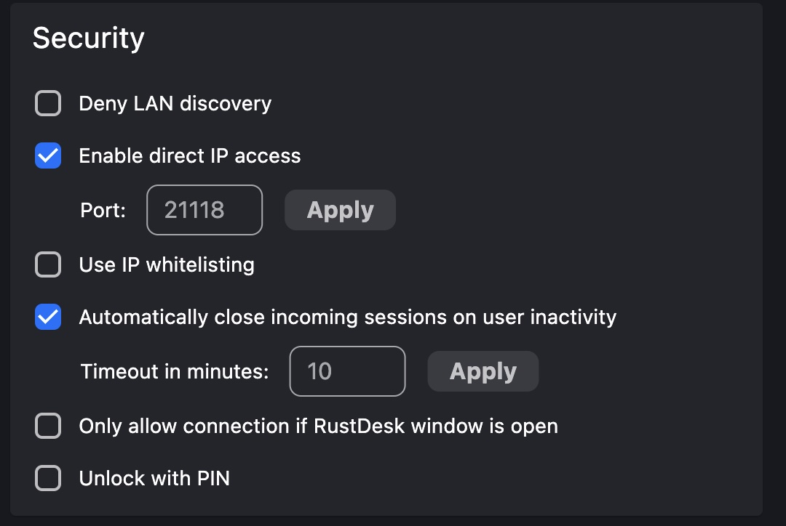
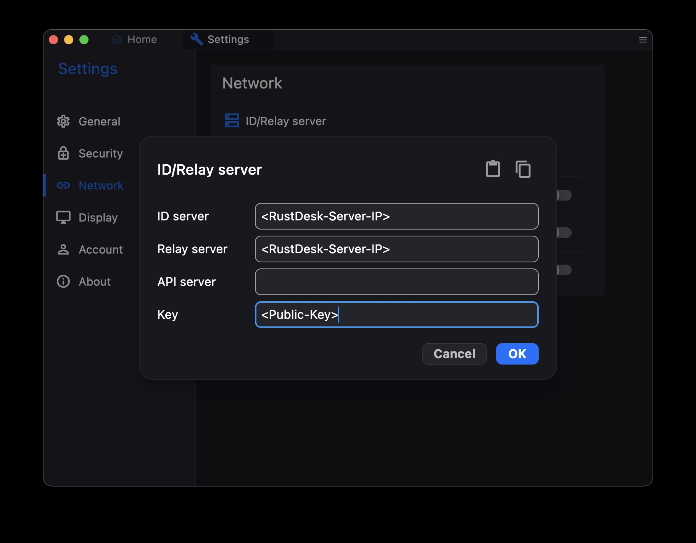
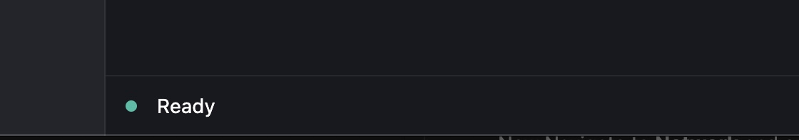

# Setting up RustDesk
In this documentation I will be setting up rust desk using docker compose.

## RustDesk Compose File
Following [this documentation](https://rustdesk.com/docs/en/self-host/rustdesk-server-oss/docker/)

My Docker Compose:
```yml
services:
  hbbs:
    container_name: hbbs
    image: rustdesk/rustdesk-server:latest
    environment:
      - ALWAYS_USE_RELAY=Y
    command: hbbs
    volumes:
      - ./data:/root
    network_mode: "host"

    depends_on:
      - hbbr
    restart: unless-stopped

  hbbr:
    container_name: hbbr
    image: rustdesk/rustdesk-server:latest
    command: hbbr
    volumes:
      - ./data:/root
    network_mode: "host"
    restart: unless-stopped
```
Copy and paste the above into `docker-compose.yml` file inside RustDesk folder. Then run:
```bash 
docker compose up -d
```
Your RustDesk server should be up and running, now its time to setup your hosts.

## Installing RustDesk on Client
*Followed [this doc](https://www.linkedin.com/pulse/building-your-own-remote-desktop-solution-rustdesk-cloud-montinaro-bv94f/) for Setup and installed*


### Setting up your Client
#### Installing RustDesk
Go to [RustDesk Site](https://github.com/rustdesk/rustdesk/releases/tag/1.4.5) pick your OS, download and install.

#### Setting your Password
First you will need to set your password to access the Client. Navigate to RustDesk settings then Security.


#### Enable IP Access
After setting up your password scroll down and then enable **Enable Direct IP Access**, and leave the default port as is.

And if you want you can create an IP whitelist.


#### Connecting Client to Server
Now to connect your Client to your Server you will first need to navigate to the folder where your ``docker-compose.yml`` file, you will find folder called ``data`` inside this folder you will find your public key ``id_ed25519.pub``. Copy the key cuz we will need it when setting up the connection between the Client & Server

Now Navigate to **Network** and open **ID/Relay server**. in there you will need to add your server IP & the public key you copied from ``id_ed25519.pub``


To check if everything is working you can navigate to home, At the bottom of the windows, you should see **"Ready"** message.


Enjoy :)